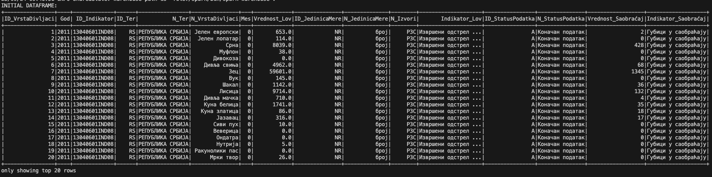
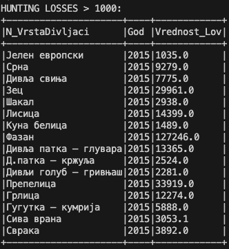
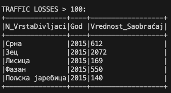
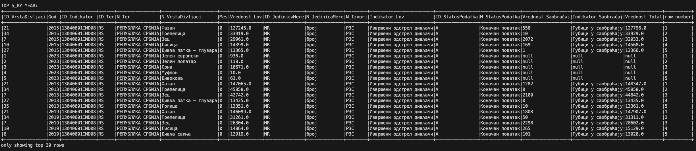
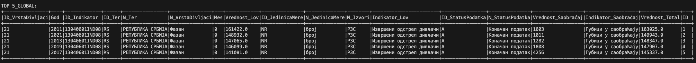
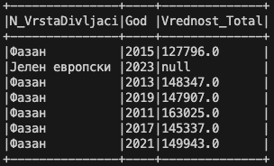
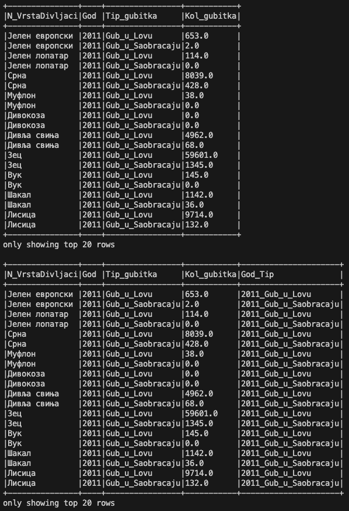
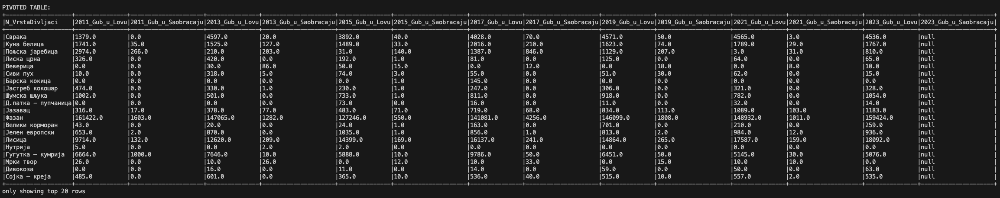
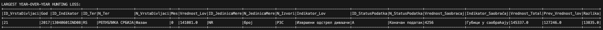

# Wildlife Losses Analysis

## Project Description
This project analyzes wildlife losses caused by **hunting** and **traffic accidents**.  
The analysis is performed using **Apache Spark** and **Python** to process and explore the datasets.

The goal is to identify trends, compare data sources, and visualize results that can help in understanding the scale of wildlife losses.

---

## Dataset
1. **Wildlife losses in hunnting**  
   [Link](https://data.gov.rs/sr/datasets/izvrsheni-odstrel-divljachi/)

2. **Wildlife losses in traffic**  
   [Link](not active any more)

**The source:** Portal otvorenih podataka Republike Srbije (data.gov.rs)

---

## Project Structure

```
wildlife/
│── wildlife_hunting_losses.csv      # Dataset with hunting-related wildlife losses
│── wildlife_traffic_losses.csv      # Dataset with traffic-related wildlife losses
│── wildlife_losses.py               # Python script with Spark transformations & analysis
│── README.md                        # Project documentation       
│── images                            # Screenshots/Visulaization                 
```

---

## Requirements
- Python 3
- Apache Spark
- HDFS
- Docker & Docker Compose (if running inside containers)

---

## Usage

### 1. Running locally
```bash
python3 wildlife_losses.py
```

### 2. Running with Docker + Spark

1. Start the Docker containers with Hadoop and Spark services (docker-compose up).
2. Place the CSV files in the mapped folder inside the Spark container.
3. Run the script using spark-submit:

```bash
docker exec -it spark-master bash
./spark-submit /opt/wildlife/wildlife_losses.py
```

---

## Results
The script generates insights and visualizations such as:
- Number of wildlife losses by year
- Comparison between hunting and traffic
- Trends in different time periods

---

## Screenshots

```markdown









```


